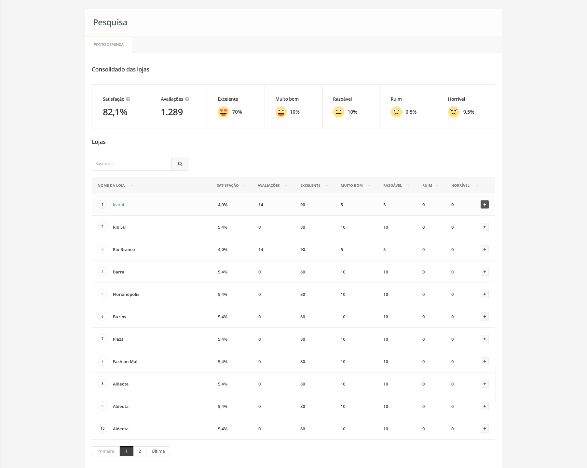
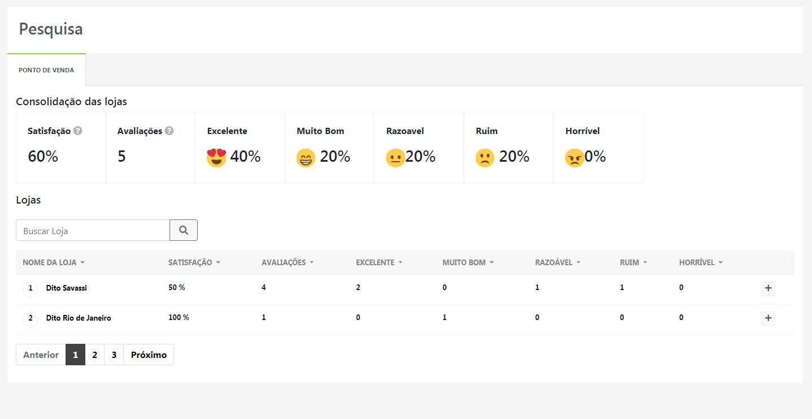
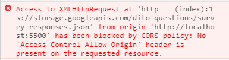

# Dito Desafio

## Oque consiste o desafio ?

Uma especie "Pesquisa de Satisfação" . Um modulo que é responsável por consolidar a forma como os usuários
dos nossos clientes avaliam sua experiência ao interagir com a marca.

Tudo com base na tentativa de replicar, este protótipo (design):

Os resultados apresentados deveriam ser vindos da API disponibilizada (endpoint): https://storage.googleapis.com/dito-questions/survey-responses.json

#### Avaliação:
Os usuários avaliaram em 5 níveis:
- Excelente
- Muito Bom
- Razoável
- Ruim
- Horrível

### Satisfação

Também é pedido para calcular o percentual de satisfação dos clientes. A soma das notas excelentes e muito bom dividido pelo número total de respostas a pesquisa.

## Resultado 

## Tecnologias utilizadas

- Bootstrap
- Emoji CSS by afeld [emoji CSS](https://afeld.github.io/emoji-css/)
- JavaScript Puro
- CSS
- Heroku (Utilizado como proxy)

## Processo desenvolvimento

O Tempo estipulo/pedido por mim foram 5 dias, porém devido a ocorrências cotidianas, executei este projeto em pouco mais de 2 dia.

### Visual

A Primeira etapa foi a tentativa da reprodução do design apresentado. Para isso utilize o *Bootsrrap*, por pura questão de familiaridade e certo domínio da ferramenta, executei esta parte com certa facilidade, em cerca de 3/4 horas, com pausas nesse período.

### Programação.

Hora de aplicar as regras de negócios exigidas e (tentar) escapulir  das pegadinhas.

#### Dificuldades.

Primeiro passo, era consumir a API. Neste momento encontrei a maior barreira do desafio: 

Ao consumi-la via *AJAX* ou *FETCH API*, um erro de CORS policy, me supreendia:
.

Para o conserto e para o prosseguimento do desenvolvimento da aplicação, nesta etapa foi gasto a maior parte do tempo, cerca de 1 dia, para resolver esse problema.

Após muita pesquisa a solução foi utilização de um proxy, entre diversas soluções encontradas a mais simples foi o [Cross Origin](crossorigin.me). Porém o mesmo estava fora do ar, então como o projeto é open source, realizei um fork do mesmo.

Para a solução acredito que precisaria de um servidor HTTPS e com o tempo escasso, optei por realizar um deploy via HEROKU, do fork.

Ao fim dessa saga, o resto do desenvolvimento foi mais simples. atento e aplicando as regras de negócio, solicitadas.
